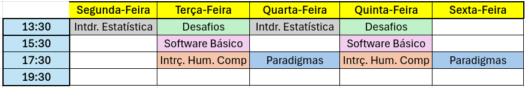

# Fourth_Period ⏰​

## 💾 Grade Horária:
​

## ​🗓️​ Datas: ​

### Software Básico (CI1064):
- [ ] Prova 1: 16/09/2025.
- [ ] Prova 2: A definir.

<h2>Nota final: --</h2>

### Paradigmas de Programação(CI1062):
- [ ] Prova 1: 03/10/2025.
- [ ] Prova 2: 14/11/2025.

<h2>Nota final: --</h2>

### Desafios de Programção (CI1031):
- [x] Semana 1: 07/08//2025.
- [x] Semana 2: 14/08/2025.
- [x] Semana 3: 21/08/2025.
- [x] Semana 4: 28/08/2025.
- [x] Semana 5: 04/09/2025.
- [ ] Semana 6: 11/09/2025.
- [ ] Semana 7: 19/09/2025.
- [ ] Semana 8: 26/09/2025.
- [ ] Semana 9: 03/10/2025.
- [ ] Semana 10: 10/10/2025.
- [ ] Semana 11: 17/10/2025.
- [ ] Semana 12: 24/10/2025.
- [ ] Semana 13: 31/10/2025.
- [ ] Semana 14: 07/11/2025.
- [ ] Semana 15: 14/11/2025.

<h2>Nota final: --</h2>

### Interação Humano-Computador (CI1350):
- [x] Entrega 1: 12/08/2025.
- [x] Prova 1: 14/08/2025.
- [ ] Entrega 2: 11/09/2025.
- [ ] Prova 2: 29/10/2025.
- [ ] Entrega 3: 04/11/2025.
- [ ] Entrega 4: 25/11/2025.

<h2>Nota final: --</h2>

### Introdução à Estatística (CE009):
- [ ] Prova 1: 10/09/2025.
- [ ] Prova 2: 22/10/2025.
- [ ] Prova 3: 26/11/2025.

<h2>Nota final: --</h2>

## Ordem crescente de datas em uma lista de todas juntas:

### [~~07/08/2025~~, ~~12/08/2025~~, 14/08/2025, 14/08/2025, 21/08/2025, 28/08/2025, 04/09/2025, 10/09/2025, 11/09/2025, 19/09/2025, 26/09/2025, 03/10/2025, 03/10/2025, 10/10/2025, 17/10/2025, 22/10/2025, 24/10/2025, 29/10/2025, 31/10/2025, 04/11/2025, 07/11/2025, 14/11/2025, 14/11/2025, 25/11/2025, 26/11/2025]

<h1>Média final do Quarto Semestre: --</h1>

